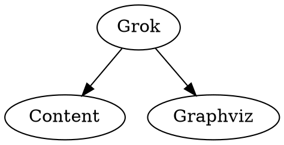

# grok

I wanted to have tool that could automatically render dot files in markdown. 

* Server mode that would be good for doing previews
* Generate individual charts and also aggregate views

tag: intro, simple

